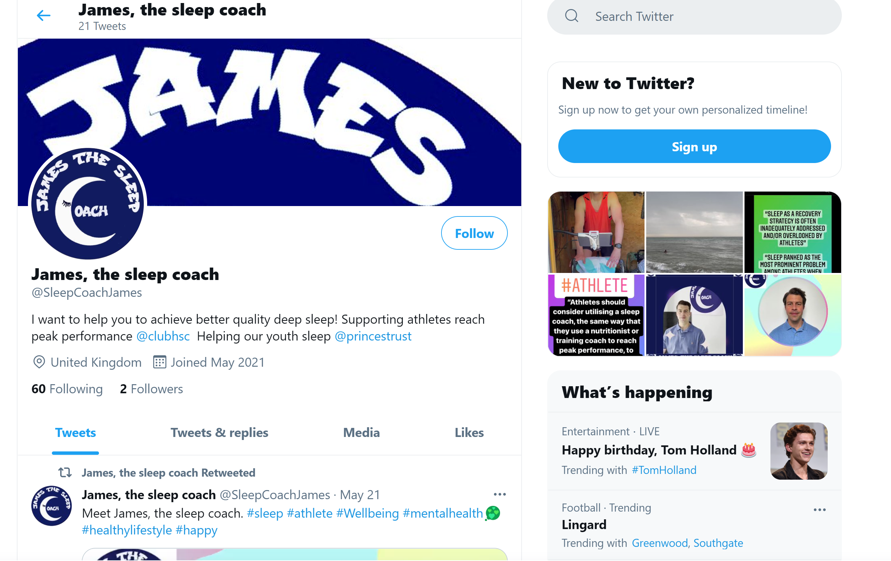

# Introduction

This is a small project demonstrating the use of Twitter bots built using the Tweepy library to connect to the Twitter API. This bot aims to find Tweets on the subject of insomnia and sleep deprivation. After identifying such a Tweet, the bot will like and Retweet said tweet, providing the author is a verified Twitter user. The aim is to easily post quality content to the https://twitter.com/sleepcoachjames?lang=en Twitter account, to organically build genuine followers.
                                                                            

## Technologies

Python 3.9.5, Tweepy 3.10.0, Black

## Project Status

Still being developed. Deployment strategy and Retweet frequencies yet to be finalised. 

###### To do:
 - decide on final deployment strategy using Google Cloud Functions and Scheduler, or AWS Lambda. 

